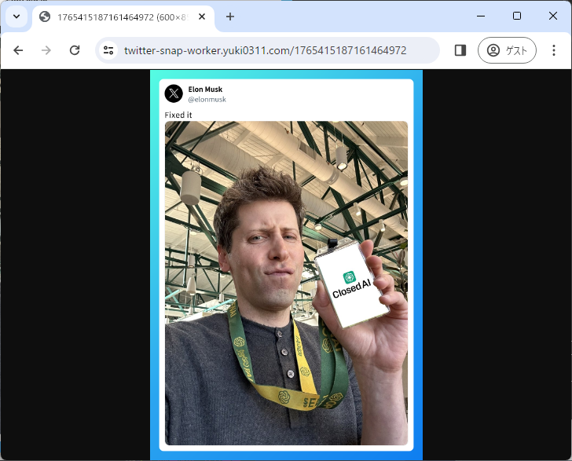

# twitter-snap-worker

CloudFlare Worker implementation of [twitter-snap](https://github.com/fa0311/twitter-snap)



Click here to see an actual example:
<https://twitter-snap-worker.yuki0311.com/1765415187161464972>


Note that I do not know when I will cancel my CloudFlare Paid plan.

## .dev.vars

```
CSRF_TOKEN = 
AUTH_TOKEN = 
```

